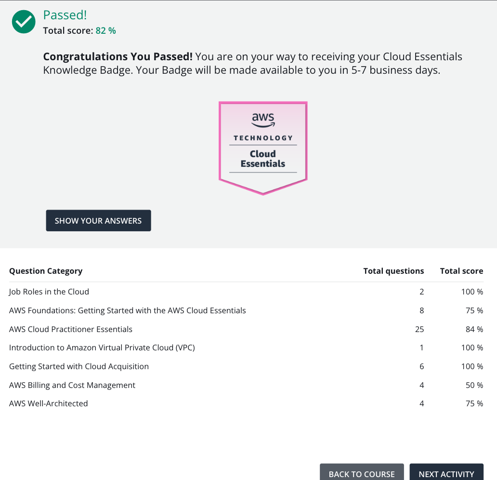

# 42-aws-cloud-practitioner-piscine

## Badge Earned

## Introduction

Repo for 42 Kuala Lumpur's AWS Cloud Practitioner Certification 14-Days Piscine.

This is a 14 days intensive group learning similar to how a 42 piscine works, whereby group members is responsible on making sure the attendance and learning progress of peers.

## Resources

[AWS Cloud Practitioner Certification](https://aws.amazon.com/certification/certified-cloud-practitioner/)

[Learning - AWS Skillbuilder](https://skillbuilder.aws/getstarted)

## Introduction to AWS (Day 1 - 2)

### Learning Objectives

- Overview of Cloud Computing and
  AWS
- Free Tier and Account Creation
- Virtual Machine, EC2
- Load balancing, ELB
- Message Queue, SNS
- Serverless, ECS, EKS, Fargate
- Deploy simple website in the EC2
  instance – instructions to be
  provided
- Deploy an AWS lambda function
