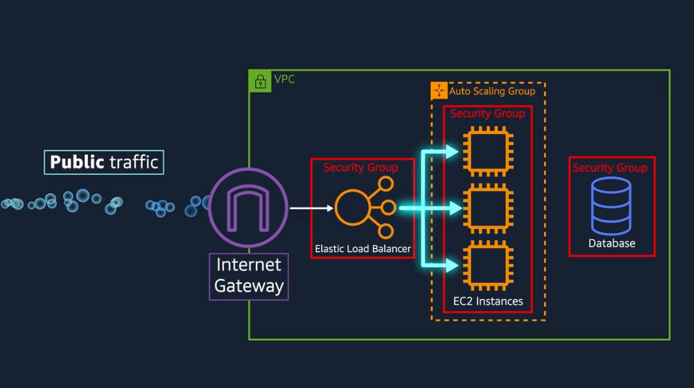
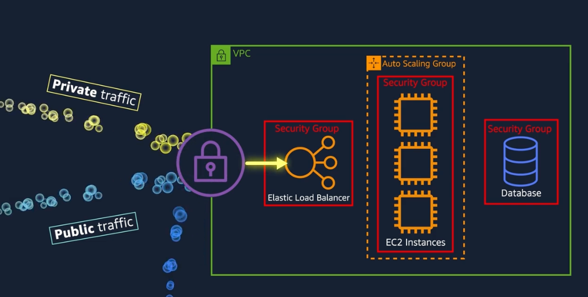
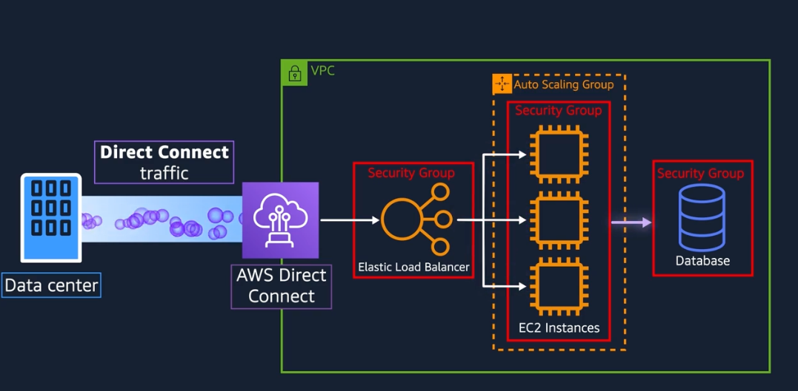

# Module-04-Global-Networking

## Learning Objectives

- Describe the basic concepts of Networking
- Difference between public and private networking
- Explain Virtual Private Gateway
- Explain Virtual Private Network

### A. Amazon Virtual Private Cloud (VPC)

- A logically isolated section where user define
- Can be public facing (with internet access) and private facing (without internet acccess)
- Private facing example: databases / application servers
- Together pulic + private - known as subnets - determined by IPs within the VPC
- Everything is EC2 Instances or ELP are inside the VPC
- Public Facing VPC
  

  - Install internet gateway

- Private Facing VPC
  

  - Install virtual private gateway
  - Allows private network to connect to virtual private gateway via VPN

- AWS Direct Connect
  

  - Private direct fibre connect from from data center to AWS

- Other Wide Range of Tools:

  - Network Hardening
  - Application Security
  - User Identity
  - Autehtication and Authorization
  - DDoS Prevention
  - Data Intergrity
  - Encryption

- The reasons to use subnet inside the VPC is to control access

- Packets are messages of the internet, when packets wants to enter a subnet's boundary, it will be checked by a Network Access Control List (Network ACL)

- Different instances within the same subnet may have different security rules, and by default all ports are blocked

- Modify the security group to accept a specific type of traffic:

  - ie. websites would accept web based - HTTPS traffic
  - disallowing administration or os level traffic
  - By default all traffics are allowed out

- Security Group vs Network ACL
  - Stateful vs Stateless

### C. Global Networking

Amazon Route 53

- Amazon's DNS
- Routing Policies
  - Latency-based
  - Geolocation DNS
  - Geoproximity routing
  - Weighted Round Robin

Amazon CloudFront

- Content-Develivery Network
