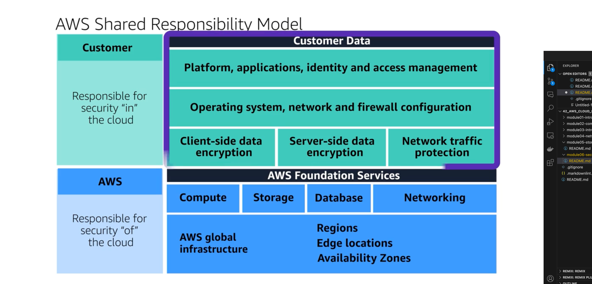
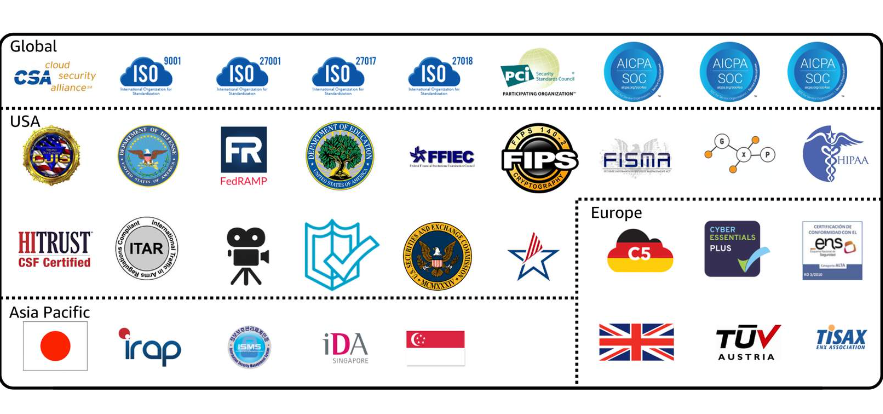

# Module-06-Security

## Learning Objectives

- Explain the benefits of the shared responsibility model
- Describe the multi-factor authentication (MFA)
- Dofferentiate between the AWS Identity and Access Management (IAM) security levels
- Explain the main benefits of AWS Organizations
- Describe security policies at a basic level
- Summarize the benefits of compliance with AWS
- Explain additional AWS security services at a basic level

### A. AWS Shared Responsibility Model

AWS => Responsible for security "of" the cloud

- Compute, Storage, Database, Networking
- AWS Global Infrastructure, Regions, Edge Locations, Availability Zones

Customer => Responsible for security "in" the cloud

- Platform, application, identity and access management
- OS, network, firewall
- client-side / server-side data encryption
- Network traffic protection

### B. User Permissions and Access

AWS Account - Root User

- Access and control any resources in the account
- Turn on MFA - (Multi-Factor Authentication)

#### AWS Identity and Access Management (AWS IAM)

- By default has no permissions
- Least privilege principle => Only what permission they need and nothing else
- IAM Policy => JSON Document
- Organize users into IAM Groups
- Roles
  - temporary permissions
  - Users / external identities / applications / other AWS services

### C. AWS Organizations

A central location to manage multiple AWS accounts.

- Centralized management of all AWS Accounts
- Consolidated billing
- Hierachical groupings
- AWS service and API actions access control
  - Service Control Policies (SCP)

### D. Compliance

Example:

- EU: General Data Protection Regulation (GDPR)
- US: Health Insurance Portability and Accountability Act (HIPAA)

#### AWS Artifact

Service that provides on-demand access on AWS security and compliance reports and select online agreements

1. AWS Artifact Agreements

   - Agreement signing with AWS
   - Sign for individial account or on behalf of organizations

2. AWS Artifact Reports

   - Compliance reports from third-party auditors

#### AWS Customer Compliance Center

Contains resources for customer to learn about AWS compliance

### E. AWS Denial-Of-Service Attacks

- Bad actor overwhelm the capacity of the application by massive requests.
- Leverage the machines of other users

Example:

- UDP Flood
- HTTP Attacks
- Slowloris Attack

  - attacker pretends a slow connection
  - Solution: Elastic Load Balancer

#### AWS Shield + AWS WAF

- Filter incoming traffic with characteristics of bad actors

1. AWS Shield Standard

   - Automatically protects all customers at no cost
   - Analyzes incoming network traffic and detect malicious ones

2. AWS Shield Advance

   - Paid service
   - Attack diagnostics
   - Intergrates with other services: CloudFront, Route 53, Elastic Load Balancing, AWS WAF (Web Application Firewall)

### F. Additional Security Services

- Encryption-at-rest
- Encryption-in-transit

#### AWS Key Management Service

- create, manage and use cryptographic keys
- access control for keys
- temporary disable keys

#### AWS WAF

- Application Firewall
- Works together with AWS CloudFront and Application Load Balancer
- Utilizes Web Access Control List (ACL)
- Blocking malicious IP address

#### Amazon Inspector

- Automated security assesment
- Check vulnerabilities and deviation from best practices
  - Generate recommendations

#### Amazon GuardDuty

- Intelligent threat detection
- Continously monitoring the network activity and account behaviour within AWS environment
- After Detection:
  - Recommend steps for remediation
  - Can invoke Lambda functions
